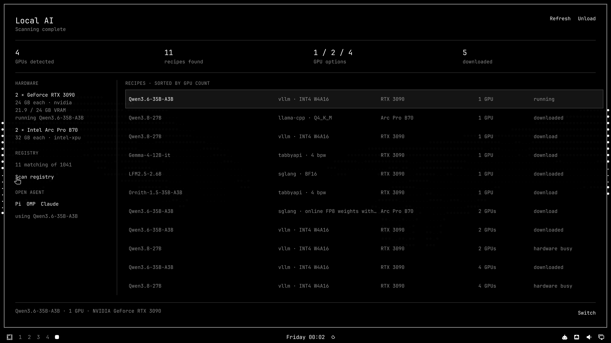

# Omarchy Local AI

A small, theme-native Omarchy plugin for running registry models on local GPUs.



[Watch the 59-second lifecycle demo](media/demo.mp4): scan, download, run,
inspect VRAM, open Pi with tool calling, switch, and unload.

## What it does

The panel has six actions:

1. Scan hardware and the registry.
2. Download one exact model revision.
3. Run a downloaded model.
4. Unload it and free its GPUs.
5. Open Pi, OMP, or Claude against the running model.
6. Switch models, restoring the previous one if acceptance fails.

Hardware is detected locally. Recipes are shown in ascending GPU-count order,
so separate 1, 2, and 4 GPU configurations stay explicit. The compact bar popup
shows current state; the full panel shows hardware, matching recipes, downloads,
VRAM, model state, and lifecycle controls.

## Install

```bash
omarchy plugin add https://github.com/0xSero/local-ai-mono.git
omarchy plugin enable sero.local-ai
```

Review the diff shown by Omarchy before enabling any third-party plugin. Plugins
run as unsandboxed user code inside the long-lived Omarchy shell.

## Registry

The plugin reads the normalized
[`local-ai-registry`](https://github.com/0xSero/local-ai-registry) Git repository.
`scan` clones or fast-forwards its `main` branch into
`~/omarchy/local-ai/registry`; the registry remains the only model, hardware,
recipe, image, and launch-argument source.

- [Browse the registry](https://local-ai-registry.vercel.app/)
- [Read the registry source](https://github.com/0xSero/local-ai-registry)
- Override for tests or private registries with `OMARCHY_AI_REGISTRY`.

## CLI

The panel and CLI share the same Bash core:

```bash
./bin/omarchy-local-ai scan
./bin/omarchy-local-ai download <model-or-recipe>
./bin/omarchy-local-ai run <model-or-recipe>
./bin/omarchy-local-ai unload
./bin/omarchy-local-ai open-agent pi # or omp / claude
./bin/omarchy-local-ai switch <model-or-recipe>
```

Diagnostic `status`, `downloads`, `task`, and `benchmark` commands support
acceptance and measurement without adding more UI.

## Dependencies

The plugin adds no packages, services, language runtimes, or build step. It uses
the Bash, Git, jq, curl, gum, Docker, Hyprland, and Quickshell facilities already
present on Omarchy. A working vendor GPU driver and Docker GPU runtime are
runtime prerequisites for inference; unsupported or busy hardware remains
visible but cannot be launched.

## Decisions

- **Separate plugin repository.** Omarchy installs and updates it through the
  normal third-party plugin lifecycle; no Omarchy files are patched.
- **Registry, not a second catalog.** The UI never embeds model names or launch
  flags. Every visible recipe resolves referenced registry records.
- **One managed container.** Lifecycle state stays understandable, and unload
  has one exact target.
- **Downloads do not run models.** Download and inference are separate actions.
- **Acceptance before success.** Run and switch require model identity plus a
  real completion. A failed switch restores the last accepted container.
- **Local by default.** The OpenAI-compatible endpoint binds to `127.0.0.1`.
- **Keep optimized graph modes.** Recipes containing eager or CUDA-graph
  disabling flags are refused.

## Verification and size

```bash
./test/all
```

The suite has 18 deterministic lifecycle, registry, safety, UI-contract, and
integration checks and does not launch a GPU. Source, manifest, and tests total
962 lines; README, license, screenshot, and video are not code and are excluded.
