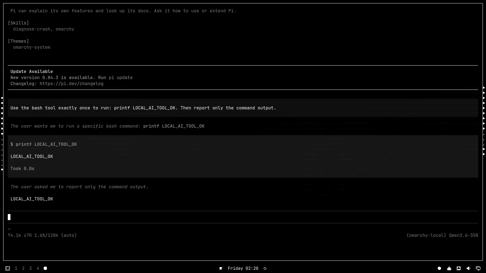

> **Archived 2026-09-03.** Superseded by [local-ai-registry](https://github.com/0xSero/local-ai-registry) (docs: https://0xsero.github.io/local-ai-registry/). Kept read-only for history.

# Omarchy Local AI

A small, theme-native Omarchy plugin for running registry models on local GPUs.


[Watch the 53-second verified lifecycle demo](media/demo.mp4): open the circle
popup, inspect detected hardware and registry recipes, run a downloaded model,
watch it pass API and tool-call acceptance, open that model in Pi, execute a
real Bash tool, and unload it. Only the model startup wait is accelerated.



## What it does

The panel drives one state machine through six actions:

1. `scan` — refresh the registry and rescan hardware.
2. `download <recipe>` — fetch one exact model revision's image and weights.
3. `run <recipe>` — load a downloaded recipe onto its matched hardware.
4. `unload` — free the hardware; downloads are kept.
5. `open-agent [pi|omp]` — open an agent wired to the running model.
6. `switch <recipe>` — replace the running model, rolling back to the
   previously accepted one if acceptance fails.

```
uninitialized -> scanning -> idle                     (no snapshot yet / scan)
idle -> downloading -> downloaded                      (download)
downloaded|idle -> starting -> ready                   (run)
ready -> switching -> ready                            (switch; rollback -> error)
ready -> unloading -> idle                              (unload)
any -> error                                           (worker failure; scan/retry clears)
```

One canonical snapshot (`omarchy-local-ai snapshot`) is the entire UI contract.
Every state write is `flock`-serialised and atomic; the CLI records a
transition and returns immediately, a detached worker advances it, and the
panel and bar widget poll the snapshot and render only from it — no model
names, launch flags, or colors are embedded in the QML.

Hardware is detected locally. Recipes are sorted by ascending GPU count, so
separate 1, 2, and 4 GPU configurations stay explicit. The compact bar popup
shows current state; the full panel shows hardware, matching recipes,
downloads, VRAM, model state, and lifecycle controls.

## Install

```bash
omarchy plugin add https://github.com/0xSero/local-ai-mono.git
omarchy plugin enable sero.local-ai
```

Review the diff shown by Omarchy before enabling any third-party plugin. Plugins
run as unsandboxed user code inside the long-lived Omarchy shell.

## Registry

The plugin reads the normalized
[`local-ai-registry`](https://github.com/0xSero/local-ai-registry) Git repository.
`scan` clones or fast-forwards its `main` branch into
`~/omarchy/local-ai/registry`; the registry remains the only model, hardware,
recipe, image, and launch-argument source. Every recipe must be
`status: validated`, pin its image by `@sha256` digest, and pin its model
revision by full commit hash before it is ever resolved or launched.

- [Browse the registry](https://local-ai-registry.vercel.app/)
- [Read the registry source](https://github.com/0xSero/local-ai-registry)
- Override for tests or private registries with `OMARCHY_AI_REGISTRY`.

## CLI

The panel and CLI share the same Bash controller (`bin/omarchy-local-ai`):

```bash
./bin/omarchy-local-ai scan
./bin/omarchy-local-ai download <recipe>
./bin/omarchy-local-ai run <recipe>
./bin/omarchy-local-ai unload
./bin/omarchy-local-ai open-agent pi   # or omp
./bin/omarchy-local-ai switch <recipe>
./bin/omarchy-local-ai snapshot        # print the canonical state snapshot
```

## Dependencies

The plugin adds no packages, services, language runtimes, or build step. It uses
the Bash, Git, jq, curl, Docker, Hyprland, and Quickshell facilities already
present on Omarchy. A working vendor GPU driver and Docker GPU runtime are
runtime prerequisites for inference; unsupported or busy hardware remains
visible but cannot be launched.

## Decisions

- **Separate plugin repository.** Omarchy installs and updates it through the
  normal third-party plugin lifecycle; no Omarchy files are patched.
- **Registry, not a second catalog.** The UI never embeds model names or launch
  flags. Every visible recipe resolves referenced registry records.
- **One managed container.** Lifecycle state stays understandable, and unload
  has one exact target. Only containers this plugin labeled are ever adopted,
  started, stopped, or removed.
- **Downloads do not run models.** Download and inference are separate actions.
- **Acceptance before success.** Run and switch require model identity plus a
  real chat completion, and a tool call for models that declare tool support.
  A failed switch restores the previously accepted container and its state,
  not the failed attempt.
- **Local by default.** The OpenAI-compatible endpoint binds to `127.0.0.1`.
- **Keep optimized graph modes.** Recipes containing eager or CUDA-graph
  disabling flags are refused.

## Verification and size

```bash
./test/all
```

The suite runs entirely against an isolated temp registry and state
directory with `docker`/`curl`/hardware shims — no GPU, network, or real
Docker daemon involved. It covers every lifecycle transition and ordering,
downloaded-vs-available recipe state, container ownership isolation, rollback
on failed acceptance, API model identity, tool-call acceptance, and the QML
snapshot-only/no-fixed-palette contract. Source, manifest, and tests stay at
or under 1000 physical lines; README, license, screenshot, and video are not
code and are excluded.
